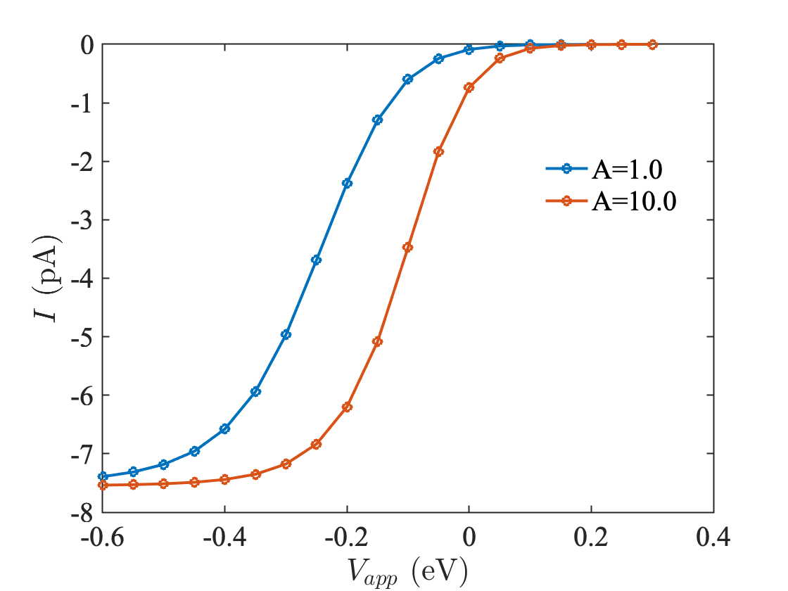

# MHC-DOS model with PNP

1. Set location of mesh (`.xml`), DOS (`.mat`) and other parameters in `config.yml`. The DOS matlab keys should be the same as the example file `dos-th_2_nsamps_30_knum_24.mat`. Specify overpotential range in `solve_vmg.sh`.

2. Julia script `script.jl` is used to compute oxidation and reduction rates based on MHC-DOS theory for each $`V_{app}`$, and are updated in the `Sol/config_$$` file. The new config file is loaded to solve the PNP equations with new values to the boundary conditions at the bottom surface of the nanopippete. MHC-DOS and other helper functions are called from private fork ([ElectrochemicalKinetics.jl](https://github.com/mbabar09/ElectrochemicalKinetics/)). 

3. Execute `./run.sh Sol` : Runs PNP equation solve on a range of $`V_{app}`$ specified in `solve_vmg.sh`. Final currents and overpotentials are collected in `Sol/iv_data.txt`. Solution files in `.h5` format are also saved in `Sol/`, and can be used for further analysis.

4. Plotting `iv_data.txt` with two different MHC-prefactors ($`1.0`$ and $`10.0`$) gives a voltammogram with the expected trend (higher prefactor --> greater slope).

## Notes

* Make bash files executable by running `chmod +x run.sh solve_vmg.sh process_vmg.sh`