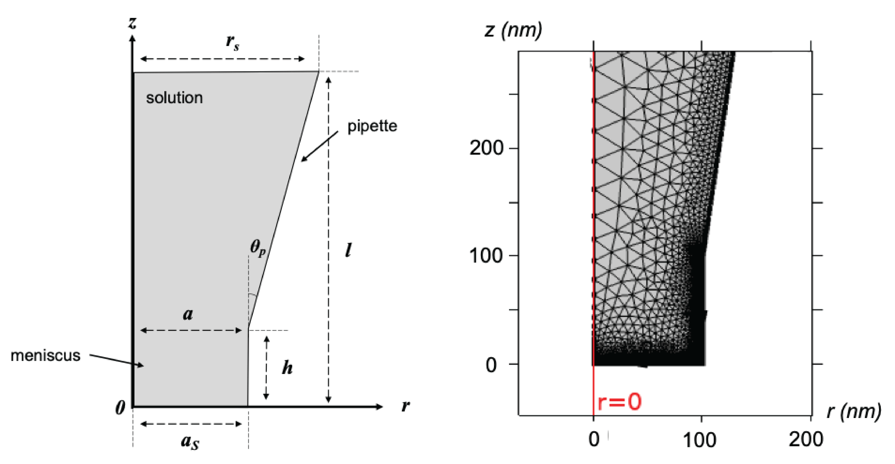

# Poisson-Nernst-Planck Kinetics

Solve steady-state coupled Poisson-Nernst-Planck equations in 3D and axisymmetric 2D nanopipette meshes using Fenics 2019.1.0. We parallelized the implementation of Julia-based rate models and plugged it into MPI-enabled PDE solver for high throughput generation of voltammograms. For higher dimensional rate models (MHC+LDOS+QC) where axisymmetry breaks, one can employ the 3D solution of the PNP system. 

For illustration, we model four concentration species (K$`^{+}`$, Cl$`^{-}`$, Ru$`^{3+}`$ and Ru$`^{2+}`$), where Ruhex (Ruthenium hexamine) is actively underdoing redox at the bottom surface ($`z=0`$) with the electrode (twisted bilayer graphene). Twisted bilayer graphene (tBLG) is a robust 2D flat band material, with tunable band structure and feasible computation of total and local density of states (DOS). KCl is the supporting electrolyte. 

## Mesh

We assume dimensions of the mesh as taken by [Yun Yu et al.](https://www.nature.com/articles/s41557-021-00865-1) 2D schematic of the axisymmetric mesh of the nanopippete is shown,



Here, 

$`a_{s} = 100`$ nm is the bottom radius

$`r_{s} = 3.5\times10^{-6}`$ m is the bottom radius

$`l = 2\times10^{-5}`$ m is the top height

**3D render in Paraview**


Mesh generation codes are in `gen_mesh/` directory. Navigate to `2D/` or `3D/` mesh generation.

## Governing equations

The following PDEs are solved simultaneously,

1) Poisson equation

<!-- $$\Delta \phi = \frac{-F}{\epsilon \epsilon_{o}} \sum_{j}z_{j}c_{j}$$ -->

2)  Nernst Planck equation (steady state)

<!-- $$D_{i}\Delta c_{i} = -\frac{z_{i}eD_{i}}{k_{B}T}\left( \nabla \left( c_{i}\nabla \phi\right) \right) $$ -->

where the four species are indexed by $`i=1,2,3,4`$.  
Here,  
$`i=1`$ : K$`^{+}`$  
$`i=2`$ : Cl$`^{-}`$  
$`i=3`$ : Ru$`^{3+}`$  
$`i=4`$ : Ru$`^{2+}`$  

Boundary Conditions (BCs), 

1. Electric potential
* $`\phi = 0 `$ at $` z=l `$, $` 0 \le r \le a_{s}`$
* $`\frac{\partial \phi}{\partial n} = (V_{dl} - \phi)/d_{h}`$ at $`z=0`$, $` 0 \le r \le a_{s}`$
* $`\frac{\partial \phi}{\partial n} = 0`$ for the side walls

where $`V_{dl}`$ is the potential of the electric double layer (EDL). We assume a linear potential drop to the bottom surface ($`z=0`$) across the Helmholtz layer as shown in this schematic. 


The applied potential ($`V_{app}`$) drops non-linearly across the EDL and the quantum capacitance in low dimensional materials, as described by [Yun Yu et al.](https://www.nature.com/articles/s41557-021-00865-1)

2. Concentration

At the top surface, the concentration of K$`^{+}`$ and Ru$`^{3+}`$ are fixed and there is no redox reaction. Cl$`^{-}`$ concentration is obtained from charge neutrality. 
These constraints are set Dirichlet boundary conditions at the top surface $`z=l`$, $` 0 \le r \le r_{s}`$.

* $`c_{1} = 100`$ mM , $`c_{2} = 106`$ mM, $`c_{3} = 2`$ mM and $`c_{4} = 0`$ mM  

Neumann condition  
* $`\frac{\partial c_{i}}{\partial n} = 0`$ (At the bottom and side surfaces if $`i=1,2`$. Only at the side surface if $`i=3,4`$) 
<!--   -->

Coupled Robin condition at the bottom surface (for i=3,4)  
* $`J_{o}(r, \theta) = -D_{o}\frac{\partial c_{3}}{\partial n} = D_{r}\frac{\partial c_{4}}{\partial n} = c_{3}k_{red}(r, \theta) - c_{4}k_{ox}(r, \theta)`$
<!--   -->

where $`k_{red}`$ and $`k_{ox}`$ are the rate constants derived from the selected rate theory, and $`D_{o}`$ and $`D_{r}`$ are diffusivity coefficients of the oxidized and reduced species respectively.

The total current is derived by,

$$i = F\int_{0}^{a_{s}} \int_{0}^{2\pi} J_{o}(r, \theta) r \text{d}r\text{d}\theta$$

As described in [ElectrochemicalKinetics.jl](https://github.com/BattModels/ElectrochemicalKinetics.jl), the supported models are Butler-Volmer, Marcus Hush, Marcus Hush Chidsey (MHC) and MHC with density of states (DOS) models. Additional effect from Quantum Capacitance (QC) in low-dimensional materials is also incorporated.

We have plugged-in the total DOS and real space local DOS of flat band materials like twisted bilayer graphene (tBLG) into MHC-DOS and QC functions of this package. The rate models modify the bottom Robin BC thereby changing the redox current at the bottom surface of the nano-pippete. The PDE is solved at sweep of overpotentials to get the steady state voltammogram. 

## Dependencies

1. Make new conda environment with legacy version of fenics (2019)
```
conda create -n fenicsproject -c conda-forge fenics
source activate fenicsproject
```
2. Install dependencies; gmsh, meshio, dragonfly, shyaml, shapely, mat73
```
pip install --upgrade gmsh
pip install meshio
pip install dragonfly-opt -v
pip install shyaml
pip install ase
pip install mat73
```
3. [Install Julia](https://julialang.org/downloads/). Clone private fork of [ElectrochemicalKinetics.jl](https://github.com/mbabar09/ElectrochemicalKinetics/) to local system. Make a new environment and add packages.
```
git clone https://github.com/mbabar09/ElectrochemicalKinetics/ 
cd ElectrochemicalKinetics.jl
activate .
add ArgParse, YAML, CSV, MAT, Glob, Interpolations, QuadGK, ClusterManagers, SharedArrays, Distributed, Zygote, SpecialFunctions
add Dierckx, Optim, NLsolve, DataStructures, Plots
```

## Usage

The overall code is divided into main solve and post processing. The following file names are common in all directories,

1. `config.yml` : Configuration file to load constants (prefactor, temperature, concentrations, charges etc.) and important paths (mesh, solution etc.). The config file is called repeatedly by different scripts to modify parameters like overpotential and solution paths. Short description of each parameter is in the file. 
2. `funcs_pnp.py` : Helper functions for PNP solve, saving files and post processing. Additional functions for 3D mesh, bayesian optimization, and MHC+LDOS formulations.
3. `pnp_par.py` : Main fenics code which solves the PNP equation. It loads mesh, constants from config.yml, specifies boundary conditions and the weak form. Parallelizabe with MPI. `pnp_par.py` for 2D and 3D meshes have adjusted boundary conditions. Also 3D-PNP with local DOS informed-MHC has additional features and interpolations in the weak form due to the extra real space dimension. 
4. `solve_vmg.sh` : Main bash file that runs pnp_par.py while attaching necessary rate model data or calculating it using ElectrochemicalKinetics.jl. It makes directories and appends necessary paths in the config file.
5. `get_current.py` : Post processing (PP) code for calculating the total current from redox reaction at the bottom surface for the given overpotential $`Vapp`$.
6. `process_vmg.sh` : Post processing bash file for running PP codes like get_current.py. User can add user-specific PP codes. Parallelized over specified number of cores. 
7. `run.sh` : Executable file that runs `solve_vmg.sh` and `process_vmg.sh`

The directories have different tests and calculations. Usage description is detailed inside the directories.

1. `gen_mesh/` : Generate 2D and 3D meshes using [gmesh](https://gmsh.info/).
2. `test_mesh/` : Test mesh convergence of PNP equations using simple Butler-Volmer (BV) rate model. I-V curve is calculated at a range of overpotentials $`Vapp`$. Can add other test suites.
3. `dragonfly_opt/` : Bayesian optimization using [Dragonfly](https://dragonfly-opt.readthedocs.io/en/master/) of the BV rate constant $`k_{o}`$ and subsequent fit of voltammogram to analytical sigmoid function. Example has 10 iteration runs of optimization. Can perform multi-variable optimization of different rate model parameters like diffusion constants $`D_{o}, D_{r}`$ and MHC-prefactor $`A`$. Directory has a readme file with more detail.
4. `dos_incorp/` : Solving PNP and voltammogram for MHC+DOS and QC modifications. Using a sample DOS of 2-deg twisted bilayer graphene.  
5. `ldos_incorp/` : Solving PNP and voltammogram using real space local DOS in MHC rate model. Using a sample LDOS of 2-deg twisted bilayer graphene. 

All DOS and LDOS calculations are done using [Stephen Carr's tight binding model for tBLG](https://github.com/stcarr/kp_tblg)

## Notes 
* Use your Julia executable path where `.jl` script is run. 
* Change the $num_cores variable in `.sh` files for assigning different number of processes for parallelization.
* Specify the mesh path in the `config.yml` file. Fenics 2019 only recognizes `.xml` format for meshes.
* For gmesh conversion to dolfin-xml use `meshio convert mesh3D.msh mesh3D.xml`

## Contributing

We are happy to take pull requests for new features, new models, etc. by pull request! It is suggested (though not required) that you first open an issue to discuss.
