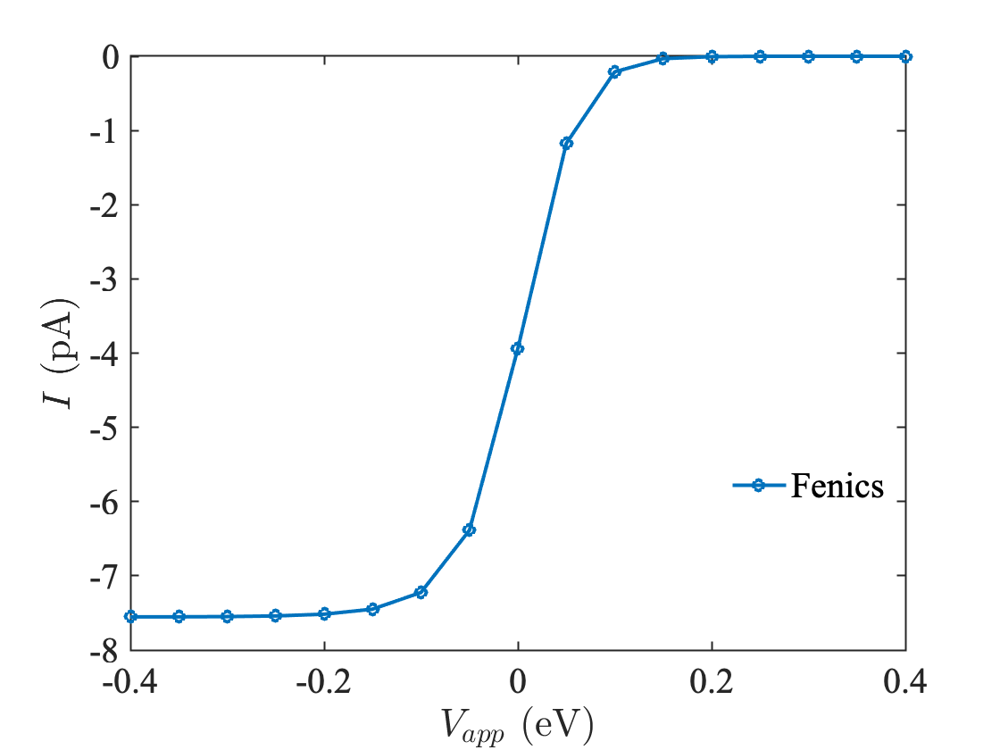

# Testing mesh for solution convergence

1. Set location of mesh (`.xml`) in `config.yml`.

2. Make bash files executable by running `chmod +x run.sh solve_vmg.sh process_vmg.sh`
3. Execute `./run.sh Sol` : Runs PNP equation solve on a range of $`V_{app}`$ specified in `solve_vmg.sh`. Final currents and overpotentials are collected in `Sol/iv_data.txt`. Solution files in `.h5` format are also saved in `Sol/`, and can be used for further analysis.

4. Plotting `iv_data.txt` gives a voltammogram with an expected shape.

